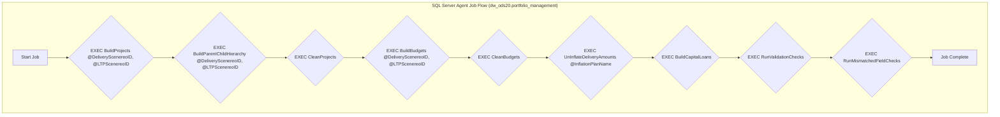
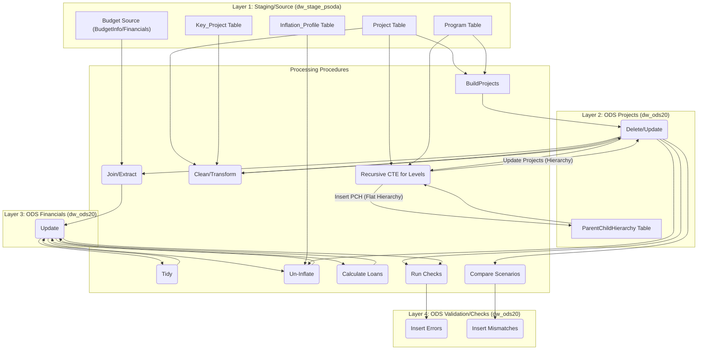
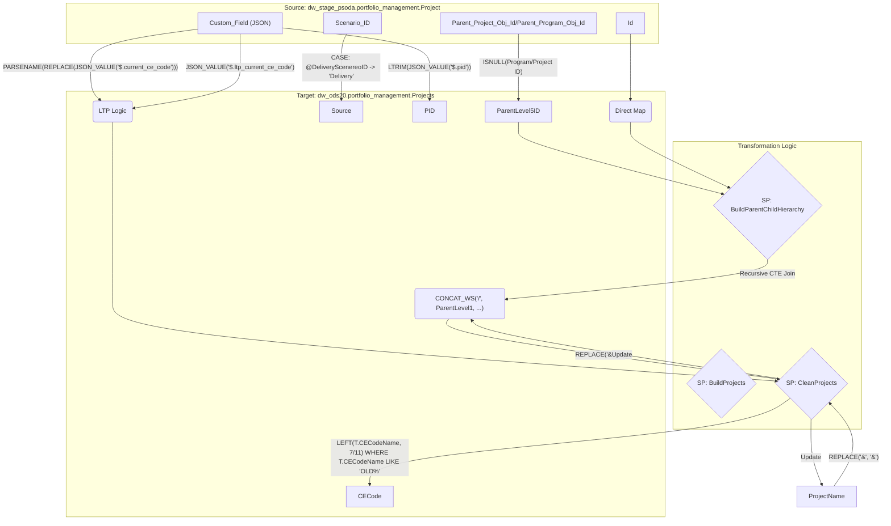
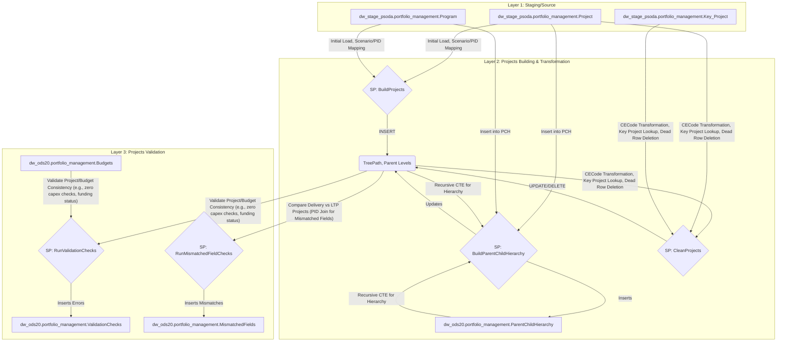
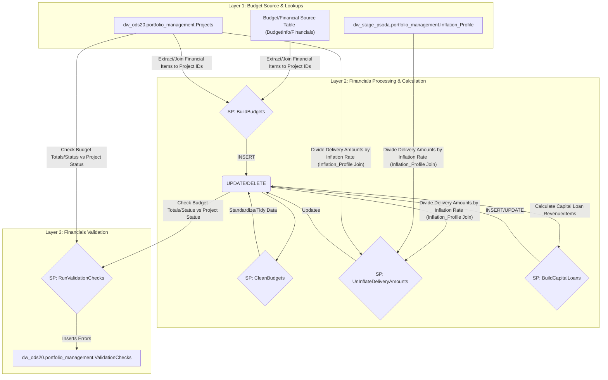

## Enhanced High-Level Flow Diagram (Execution Sequence)
This diagram shows the sequential execution of the stored procedures, including the schema and key parameters passed during the SQL Agent Job execution.

## Enhanced Layered Diagram (Processing Stage Grouping)
This view groups objects by their logical processing layer and details the type of operation performed by the stored procedures (e.g., Insert, Update, Recursive Update).

## Detailed Column Lineage (Projects Focus)
This lineage details specific transformation functions, focusing on the core fields within the dw_ods20.portfolio_management.Projects table, particularly for scenario-based logic and cleaning.

## Enhanced Split Diagram: Projects Data Lineage
This diagram details the life cycle of the project data, including initial loading, hierarchy building, cleaning, and eventual scenario comparison and validation.

## Enhanced Split Diagram: Budget Data Lineage
This diagram details the financial processing path, highlighting the crucial steps of joining to projects, cleaning, applying un-inflation logic, and calculating capital loans.

