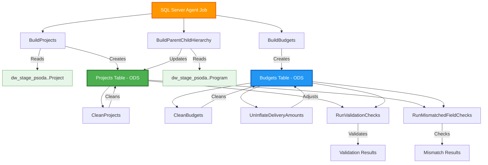
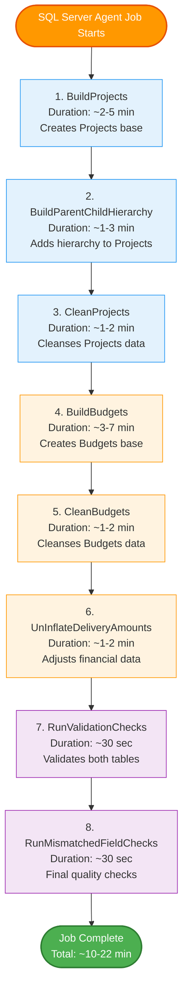
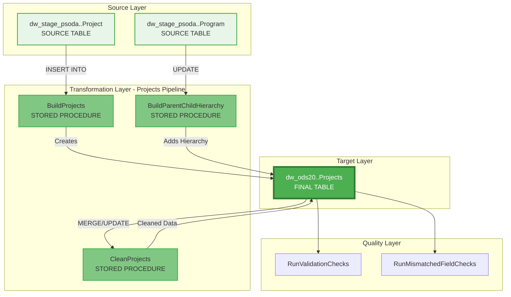
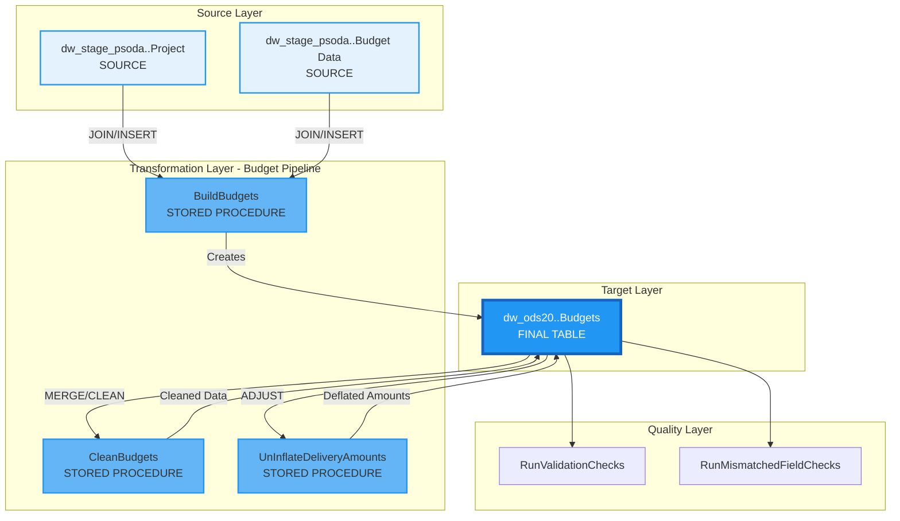
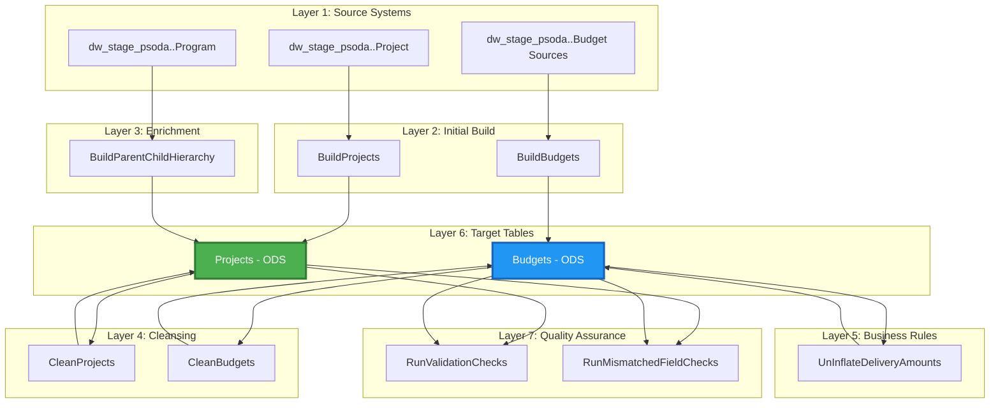
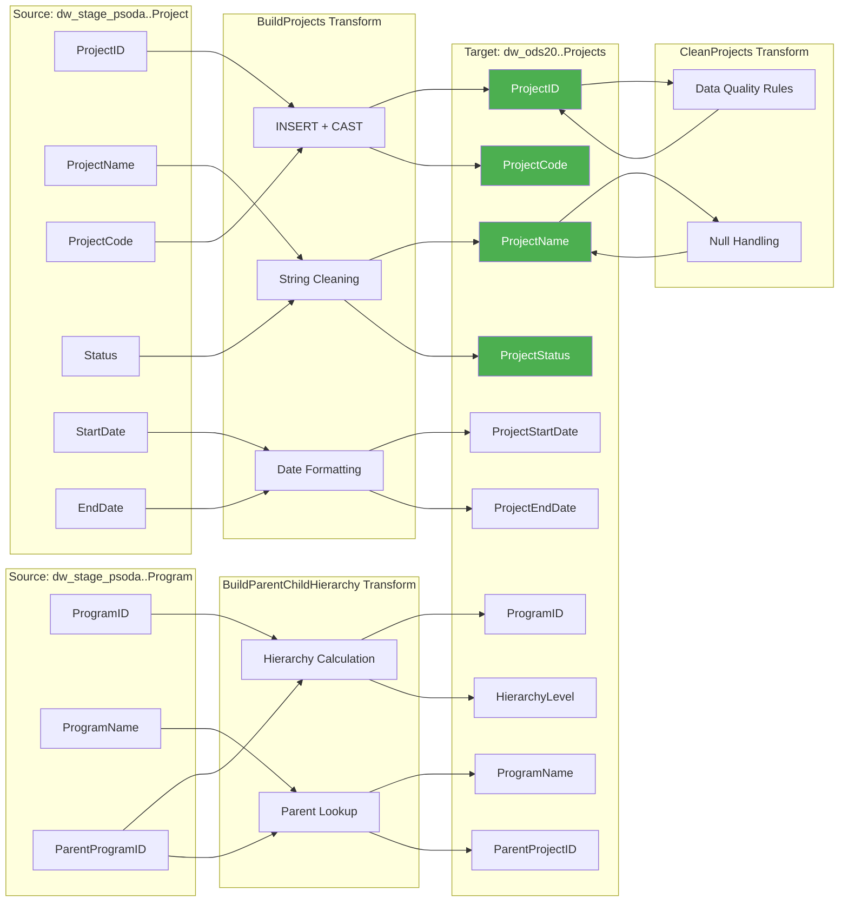
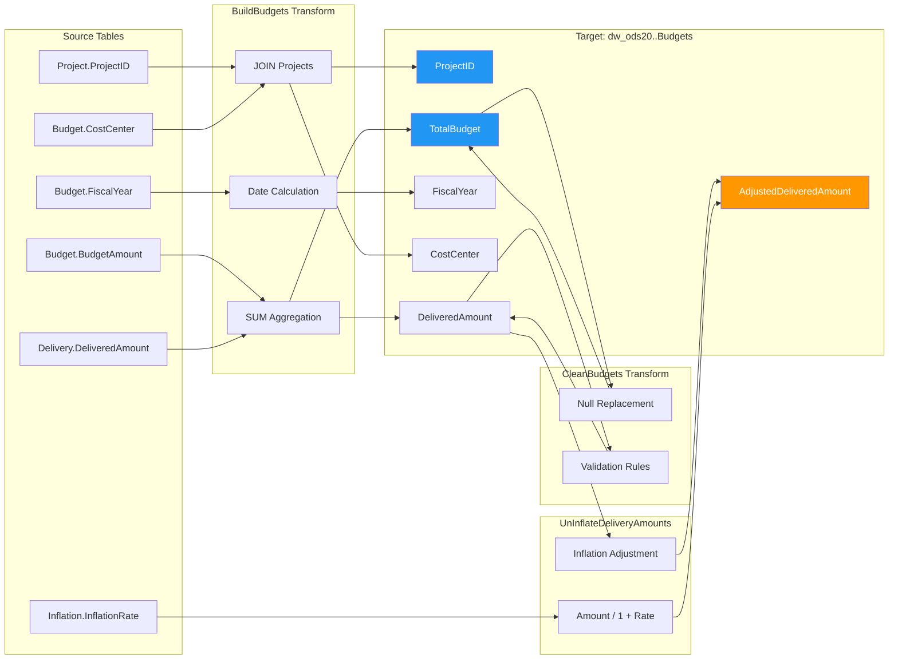

# NZQA Certificate Generator - Docker Package

## 📦 Complete Package Contents

This package contains everything you need to run the NZQA Certificate Generator demo.

## High Level




Execution Sequence


Project Pipeline


Budget Pipeline


Processing Layers


Projects Field Lineage


Budget Field Lineage


```
nzqa-cert-demo/
├── dockerfile        
├── docker-compose.yml        (dockerfiles to setup developmental environment)
├── requirements.txt          (libraries to use)
├── app.py                    (the app/template to modify to your needs for Snowflake Apps)
├── bash.sh         
├── setup.bat
├── .streamlit/
│   └── config.toml
├── templates/                (will be created)
└── output/                   (will be created)
├── fonts/                    (contains closest font family utilised by NZQA)
└── images/                   (contains mock certificate backgrounds which app refers to)
```

## 🚀 What this is

Streamlit is the foundational application interface (within Snowflake) allowing users to create dashboards, paginated reports, and web/interactive applications.
This body of work demonstrates (with example data) how to create certificates for printing/publication (from within Snowflake). 
All that is required is researching and modifying the code to your needs, and building/connecting pipelines/tables to your application.
All the best (this is just a quick mock example - in no way is it production or final).

## 🚀 Quick Start

### 🔧 Manual Setup

**Step 1: Build and Start**
```bash
docker-compose up --build -d
```

**Step 2: Access Application**
Open browser to: http://localhost:7500

**Step 3: Stop When Done**
```bash
docker-compose down
```
---

## 📋 Prerequisites

1. **Docker Desktop** installed and running
   - Windows: https://docs.docker.com/desktop/install/windows-install/
   - macOS: https://docs.docker.com/desktop/install/mac-install/
   - Linux: https://docs.docker.com/desktop/install/linux-install/

2. **Port 8501** available (or change to different port)

3. **4GB RAM** minimum allocated to Docker

---

## 🎯 For Client Demonstrations

### Before the Demo

```bash
# Start the container (in background)
docker-compose up -d

# Verify it's running
docker-compose ps

# Check it's accessible
curl http://localhost:7500
```

### During the Demo

1. Open browser to: **http://localhost:7500**
2. Navigate through tabs to show features
3. Generate sample certificates
4. Download PDFs to show quality

---

## 🛠️ Common Commands

### Container Management

```bash
# Start container
docker-compose up -d

# Stop container
docker-compose down

# Restart container
docker-compose restart

# View logs (live)
docker-compose logs -f

# View last 50 log lines
docker-compose logs --tail=50

# Check status
docker-compose ps

# Rebuild after code changes
docker-compose up --build -d
```

### Docker Management

```bash
# View all containers
docker ps -a

# View resource usage
docker stats

# Remove unused images
docker image prune -a

# Remove unused containers
docker container prune

# Complete cleanup
docker system prune -a
```

### Application Access

```bash
# Access from host machine
http://localhost:7500

# Access from same network (use host IP)
http://192.168.1.x:7500

# Check if running
curl -I http://localhost:7500/_stcore/health
```

---

## 🎨 Customization

### Change Port

**Edit docker-compose.yml:**
```yaml
ports:
  - "7500:8501"  # Change to your preferred port
```

Then access at: http://localhost:7500

### Modify Sample Data

Edit the `load_sample_data()` function in `streamlit_app.py`

### Change Branding Colors

Edit `.streamlit/config.toml`:
```toml
[theme]
primaryColor = "#c41e3a"  # NZQA red - change to your color
backgroundColor = "#ffffff"
secondaryBackgroundColor = "#f0f2f6"
textColor = "#262730"
```

Rebuild after changes:
```bash
docker-compose down
docker-compose up --build -d
```

---

## 🔧 Troubleshooting

### Issue: Port 8501 already in use

**Check what's using the port:**
```bash
# Windows
netstat -ano | findstr :8501

# macOS/Linux
lsof -i :8501
```

**Solution 1:** Stop the conflicting service

**Solution 2:** Use different port in docker-compose.yml
```yaml
ports:
  - "8502:8501"  # Use 8502 instead
```

### Issue: "Cannot connect to Docker daemon"

**Solution:**
1. Ensure Docker Desktop is running
2. Check system tray/menu bar for Docker icon
3. Restart Docker Desktop
4. On Linux: `sudo systemctl start docker`

### Issue: Container exits immediately

**Check logs:**
```bash
docker-compose logs

# Or for more detail:
docker logs nzqa-certificate-demo
```

**Common causes:**
- Port already in use
- Missing dependencies
- Syntax error in code

**Solution:**
```bash
docker-compose down
docker-compose up --build
# Watch logs for errors
```

### Issue: "No space left on device"

**Clean up Docker:**
```bash
docker system prune -a --volumes
# Warning: This removes ALL unused Docker data
```

### Issue: Slow performance

**Increase Docker resources:**
1. Docker Desktop → Settings → Resources
2. Increase:
   - Memory: 4GB minimum (8GB recommended)
   - CPUs: 2 minimum (4 recommended)
   - Disk: 20GB minimum

### Issue: Changes not reflected

**Full rebuild:**
```bash
docker-compose down
docker-compose build --no-cache
docker-compose up -d
```

### Issue: Permission denied (Linux)

**Add user to docker group:**
```bash
sudo usermod -aG docker $USER
# Log out and back in
```

---

## 📊 Resource Usage

**Typical usage:**
- **Disk Space:** ~1GB (Docker image)
- **Memory:** 200-300MB (idle), 500MB-1GB (active)
- **CPU:** <5% (idle), 20-40% (generating certificates)

**Container startup time:** 5-10 seconds

**Certificate generation speed:**
- Single: <1 second
- Bulk (100): ~30 seconds
- Bulk (1000): ~5 minutes

---

## 🌐 Network Access

### Local Network Access

Other devices on your network can access using your machine's IP:

```bash
# Find your IP
# Windows: ipconfig
# macOS/Linux: ifconfig or ip addr

# Share with others:
http://YOUR-IP-ADDRESS:8501
# Example: http://192.168.1.100:8501
```

**Ensure firewall allows:**
- Port 8501 (or your chosen port)
- Inbound connections

### Remote Access Options

#### Option 1: ngrok (Quick & Easy)
```bash
# Install ngrok: https://ngrok.com
ngrok http 8501

# Share the URL: https://xxxx.ngrok-free.app
# Free tier: 2 hours per session
```

#### Option 2: Tailscale (Secure VPN)
```bash
# Install Tailscale: https://tailscale.com
# Connect both machines to Tailscale network
# Access via Tailscale IP: http://100.x.x.x:8501
```

#### Option 3: SSH Tunnel
```bash
# On client machine:
ssh -L 8501:localhost:8501 user@your-server

# Access: http://localhost:8501
```

---

## ☁️ Cloud Deployment

### Deploy to AWS ECS

```bash
# 1. Build and tag image
docker build -t nzqa-cert-generator .
docker tag nzqa-cert-generator:latest \
  YOUR_ACCOUNT.dkr.ecr.REGION.amazonaws.com/nzqa-cert-generator:latest

# 2. Login to ECR
aws ecr get-login-password --region REGION | \
  docker login --username AWS --password-stdin \
  YOUR_ACCOUNT.dkr.ecr.REGION.amazonaws.com

# 3. Push image
docker push YOUR_ACCOUNT.dkr.ecr.REGION.amazonaws.com/nzqa-cert-generator:latest

# 4. Create ECS service via AWS Console or CLI
```

### Deploy to Azure Container Instances

```bash
# 1. Login to Azure
az login

# 2. Create resource group
az group create --name nzqa-demo-rg --location australiaeast

# 3. Create container instance
az container create \
  --resource-group nzqa-demo-rg \
  --name nzqa-cert-generator \
  --image nzqa-cert-generator:latest \
  --dns-name-label nzqa-demo-unique \
  --ports 8501

# Access: http://nzqa-demo-unique.australiaeast.azurecontainer.io:8501
```

### Deploy to Google Cloud Run

```bash
# 1. Build and push to GCR
gcloud builds submit --tag gcr.io/PROJECT_ID/nzqa-cert-generator

# 2. Deploy to Cloud Run
gcloud run deploy nzqa-cert-generator \
  --image gcr.io/PROJECT_ID/nzqa-cert-generator \
  --platform managed \
  --region australia-southeast1 \
  --allow-unauthenticated \
  --port 8501

# Get URL from output
```

### Deploy to DigitalOcean App Platform

```bash
# 1. Create app.yaml
spec:
  name: nzqa-cert-generator
  services:
  - name: web
    dockerfile_path: Dockerfile
    http_port: 8501
    instance_count: 1
    instance_size_slug: basic-xxs

# 2. Deploy via doctl or web interface
doctl apps create --spec app.yaml
```

---

## 🔐 Security Considerations

### For Local Demos
✅ No external network access required  
✅ Data stays on your machine  
✅ No authentication needed  

### For Remote Demos
⚠️ Add authentication if exposing to internet  
⚠️ Use HTTPS (via reverse proxy or ngrok)  
⚠️ Limit access duration (use temporary tunnels)  

### For Production
🔒 Implement proper authentication (OAuth, SAML)  
🔒 Use HTTPS with valid certificates  
🔒 Set up firewall rules  
🔒 Enable audit logging  
🔒 Regular security updates  

---

## 📝 Development Mode

For making changes without rebuilding:

**Edit docker-compose.yml:**
```yaml
services:
  nzqa-cert-generator:
    build: .
    volumes:
      # Mount code for live updates
      - ./streamlit_app.py:/app/streamlit_app.py
      - ./templates:/app/templates
      - ./output:/app/output
    ports:
      - "8501:8501"
```

**Now code changes reflect immediately** (Streamlit auto-reloads)

**To test:**
1. Start container: `docker-compose up -d`
2. Edit `streamlit_app.py`
3. Refresh browser - changes appear!

---

## 🧪 Testing

### Verify Installation

```bash
# 1. Container is running
docker ps | grep nzqa

# 2. Application responds
curl -I http://localhost:8501/_stcore/health

# 3. Generate test certificate
# Open http://localhost:8501 and generate a certificate
```

### Load Testing

```bash
# Install Apache Bench
# Ubuntu: apt-get install apache2-utils
# macOS: brew install ab

# Test 100 requests
ab -n 100 -c 10 http://localhost:8501/
```

### Container Health Check

```bash
# Manual health check
docker inspect --format='{{.State.Health.Status}}' nzqa-certificate-demo

# Should return: healthy
```

---

## 📦 Backup & Export

### Export Docker Image

```bash
# Save image to file
docker save nzqa-cert-generator:latest | gzip > nzqa-cert-generator.tar.gz

# Transfer to another machine
# Then load:
docker load < nzqa-cert-generator.tar.gz
```

### Backup Generated Certificates

```bash
# Certificates are in ./output folder
tar -czf certificates-backup-$(date +%Y%m%d).tar.gz output/

# Or copy to safe location
cp -r output/ /path/to/backup/
```

### Backup Configuration

```bash
# Backup all configuration files
tar -czf nzqa-demo-config.tar.gz \
  Dockerfile \
  docker-compose.yml \
  requirements.txt \
  .streamlit/config.toml \
  streamlit_app.py
```

---

## 🔄 Updates & Maintenance

### Update Application Code

```bash
# 1. Edit streamlit_app.py
# 2. Rebuild and restart
docker-compose down
docker-compose up --build -d
```

### Update Dependencies

```bash
# 1. Edit requirements.txt
# 2. Rebuild
docker-compose build --no-cache
docker-compose up -d
```

### Update Base Image

```bash
# Edit Dockerfile to use newer Python version
FROM python:3.10-slim  # was 3.9-slim

# Rebuild
docker-compose build --no-cache
docker-compose up -d
```

---

## 📈 Scaling

### Single Machine Scaling

**Increase resources in docker-compose.yml:**
```yaml
services:
  nzqa-cert-generator:
    deploy:
      resources:
        limits:
          cpus: '4'
          memory: 8G
        reservations:
          cpus: '2'
          memory: 4G
```

### Multiple Instances (Load Balancing)

**docker-compose.yml:**
```yaml
services:
  nzqa-cert-generator:
    build: .
    deploy:
      replicas: 3  # Run 3 instances
    ports:
      - "8501-8503:8501"  # Map to different ports
```

### Production Scaling

**Move to Snowflake** for:
- Thousands of certificates
- Enterprise deployment
- Direct database integration
- Advanced features

---

## 🎓 Training & Documentation

### User Training Materials

Generate these from your demo:
1. Screenshots of each feature
2. Step-by-step guide
3. Video walkthrough (record demo)
4. FAQ document

### Technical Documentation

Included files:
- `README.md` (this file) - Setup & usage
- Code comments in `streamlit_app.py`
- Docker configuration documentation

---

## 💰 Cost Estimates

### Local/Demo Deployment
**Cost:** $0 (free)
- Uses your machine's resources
- No cloud costs

### Cloud Deployment (Monthly Estimates)

**AWS ECS Fargate:**
- 1 task, 0.5 vCPU, 1GB RAM
- 24/7 uptime: ~$15/month
- On-demand only: ~$2/month

**Azure Container Instances:**
- 1 vCPU, 1GB RAM
- 24/7 uptime: ~$30/month
- On-demand only: ~$3/month

**Google Cloud Run:**
- 1 vCPU, 1GB RAM
- Pay per use: $1-5/month typical
- Free tier included

**DigitalOcean:**
- Basic droplet: $6/month
- App Platform: $12/month

### Snowflake Production (Best Value)
- Runs inside existing Snowflake account
- Only pay for compute used
- 1000 certificates: ~$2-4
- No infrastructure costs

---

## 🆘 Support & Resources

### Getting Help

**Check logs first:**
```bash
docker-compose logs -f
```

**Common solutions:**
1. Restart: `docker-compose restart`
2. Rebuild: `docker-compose up --build -d`
3. Clean start: `docker-compose down && docker-compose up -d`

### Useful Links

- Docker Documentation: https://docs.docker.com
- Streamlit Documentation: https://docs.streamlit.io
- Pillow Documentation: https://pillow.readthedocs.io
- NZQA Website: https://www.nzqa.govt.nz

### Community Resources

- Docker Community: https://forums.docker.com
- Streamlit Community: https://discuss.streamlit.io

---

## 📋 Checklist for Client Demo

**Pre-Demo (30 minutes before):**
- [ ] Docker Desktop running
- [ ] Container started: `docker-compose up -d`
- [ ] Verified accessible: http://localhost:8501
- [ ] Generated test certificate successfully
- [ ] Downloaded PDF to show quality
- [ ] Prepared talking points
- [ ] Have backup screenshots ready
- [ ] Network/internet connection stable
- [ ] Screen sharing software tested (if remote)

**During Demo:**
- [ ] Show sample data integration
- [ ] Generate single certificate
- [ ] Demonstrate customization options
- [ ] Show bulk generation capabilities
- [ ] Download and show PDF quality
- [ ] Discuss Snowflake production benefits
- [ ] Answer questions
- [ ] Collect feedback

**Post-Demo:**
- [ ] Stop container: `docker-compose down` (or leave running)
- [ ] Send follow-up email with:
  - [ ] Demo recording link (if recorded)
  - [ ] Sample certificates generated
  - [ ] Pricing proposal
  - [ ] Next steps timeline
  - [ ] Technical documentation

---

## 🎉 You're Ready!

Your NZQA Certificate Generator demo is ready to go!

**Quick commands recap:**

```bash
# Start everything
docker-compose up -d

# Access application
http://localhost:7500

# View logs
docker-compose logs -f

# Stop everything
docker-compose down
```

**Need help?** Check the troubleshooting section above or review the logs.

**Ready for production?** Contact us to discuss Snowflake deployment.

---

## 📄 License & Credits

**Application:** NZQA Certificate Generator Demo  
**Built with:** Streamlit, Pillow, ReportLab  
**Containerization:** Docker  
**For:** Educational certificate generation  

**NZQA Branding:** Ensure you have appropriate permissions to use NZQA logos and branding for certificate generation.

---

*Last Updated: 2025-10-21*  
*Version: 1.0.0*
